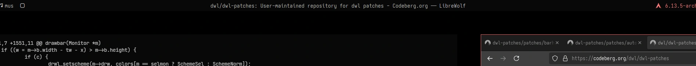

### Description
A homegrown port of dwm's _truecenteredtitle_ patch, with the addition of a config option to toggle its effects. Requires [the bar patch](https://codeberg.org/dwl/dwl-patches/src/branch/main/patches/bar) to be applied beforehand.

### Download
- [v0.7](/dwl/dwl-patches/raw/branch/main/patches/bartruecenteredtitle/bar-truecenteredtitle-v0.7.patch) Targets latest dwl release v0.7.

### Author
- [moonsabre](https://codeberg.org/moonsabre)
